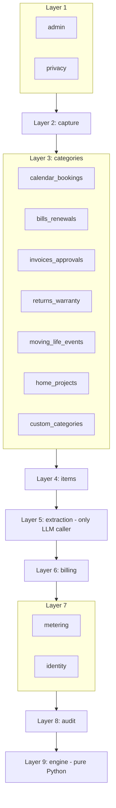

# 05 - Context map

Source of truth: `qa/contexts.toml` (checked against `src/deepaira/*` and `.importlinter`).

A higher layer may import a lower one. Siblings on one layer never import each other. Skipping layers is allowed (for example `items` may use `engine` directly).

| Context | Owns | Table prefix |
|---|---|---|
| admin | support tools, metrics views | adm |
| privacy | export, deletion, consent | prv |
| capture | inbound email, paste, upload | cap |
| calendar_bookings ... custom_categories | category rules and views | cal, bil, inv, ret, mov, hom, cus |
| items | the tracked item, reminders, approvals | itm |
| extraction | LLM provider interface, prompts, output validation | ext |
| billing | plans, entitlements | bll |
| metering | usage ledger and cost | met |
| identity | accounts and sessions | idn |
| audit | append-only action history | aud |
| engine | dates, time zones, recurrence, conflicts | eng |

Open question: may Django foreign keys cross contexts? Until decided, reference other contexts by plain ID.
